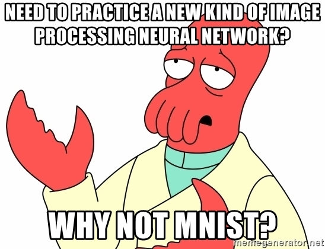
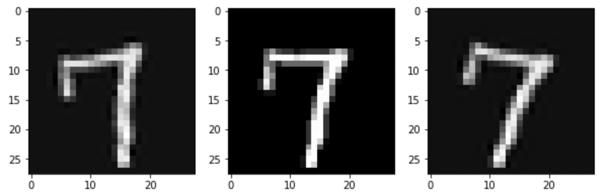

# MNIST Handwritten Digits Classifier

This dataset is considered to be one of the most used dataset for learning Machine Learning. So much that there are memes made out of it. Regardless, it is indeed, a great dataset that enables one to learn the concepts of Binary Classification, Multi-label Classification, Different ML Models, Different Metrics to measure the performance of the models, Feature Engineering/Data Augmentation, Image Processing.

I am currently studying the textbook [Hands-On Machine Learning with Scikit-Learn, Keras, and TensorFlow: Concepts, Tools, and Techniques to Build Intelligent Systems](https://www.amazon.com/Hands-Machine-Learning-Scikit-Learn-TensorFlow/dp/1492032646/ref=asc_df_1492032646/?tag=hyprod-20&linkCode=df0&hvadid=385599638286&hvpos=&hvnetw=g&hvrand=17326686135079154346&hvpone=&hvptwo=&hvqmt=&hvdev=c&hvdvcmdl=&hvlocint=&hvlocphy=1018127&hvtargid=pla-523968811896&psc=1&tag=&ref=&adgrpid=79288120515&hvpone=&hvptwo=&hvadid=385599638286&hvpos=&hvnetw=g&hvrand=17326686135079154346&hvqmt=&hvdev=c&hvdvcmdl=&hvlocint=&hvlocphy=1018127&hvtargid=pla-523968811896) This book recommends to try this MNIST Digits Classifier [dataset](https://www.kaggle.com/c/digit-recognizer) at the end of the third chapter.

There are two notebooks in the repository. I have used the 'mnist_local' to explore the dataset and perform some analysis and the 'mnist-classifier' to submit in Kaggle competition. In the second notebook, I have implemented data augmentation where I have taken the images in the training set and rotated them by 10 degrees in left and right direction both. This created a total of 3 times the initial train data which has been used to create a KNN Classifier model. Randomized Search Cross Validation method is also implemented to tune the hyperparameters. This led to the accuracy of 97.51%. Not bad I guess.

# Key learnings - 
- Randomized Search CV to tune the hyperparameter tuning improves performance (72% to 95%)
- Data Augmentation to create more artificial training data improves performance on the test set 
- Image processing with NumPy, SciPy
  
